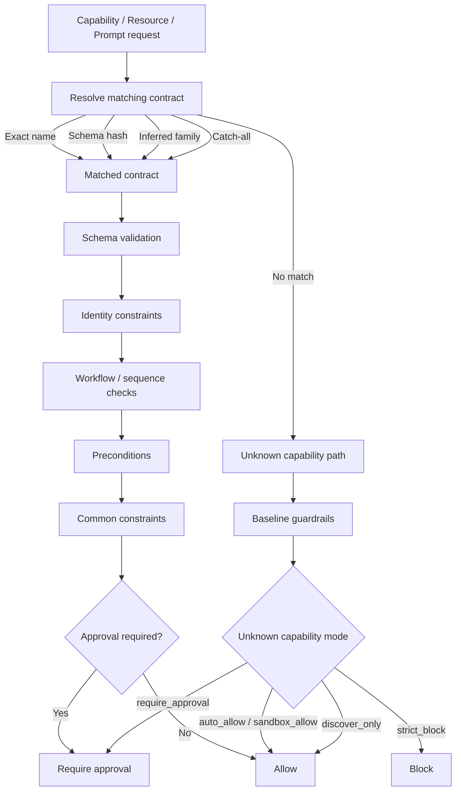

# Layer B

Layer B is the capability contract and policy enforcement layer for tool-using agents.

Its job is simple:

- every capability call is checked before execution
- the decision is always one of `allow`, `block`, or `require_approval`
- the decision is traceable through a local event log and optional LangWatch events

Layer B does not execute tools by itself. It decides whether a tool call, resource read, or prompt access is allowed.

## How It Works



## What Layer B Checks

Layer B can validate:

- JSON Schema for tool arguments
- allowed agents and frameworks
- workflow transitions and allowed capability sequences
- evidence and trust thresholds
- path constraints
- URL and SSRF-style domain constraints
- SQL safety rules
- body and argument size limits
- prompt and resource access approval

It also supports output postconditions through output sanitization.

## Unknown Tools

Unknown tools are tools that exist at runtime but do not yet have a policy contract.

Current default behavior:

- common tool families can be inferred with built-in zero-config contracts
- named project YAML contracts still override inferred defaults
- safe unknown tools that do not match a family are auto-allowed
- dangerous unknown args can still escalate to approval
- obviously unsafe paths, URLs, SQL, and oversized bodies still block before the mode decision

The practical order is now:

- exact capability name
- argument schema hash
- inferred family
- catch-all
- unknown capability mode

For SDK adopters this means Layer B works out of the box, while developers can still add exact-name contracts in `policy/tool_permissions.yaml` to override any default behavior per tool.

The unknown capability mode is controlled by `ASCP_UNKNOWN_CAPABILITY_MODE`.

Supported values:

- `auto_allow`
- `require_approval`
- `strict_block`
- `discover_only`
- `sandbox_allow`

`auto_allow` is the friendly alias for the current default behavior.

## Traceability

Layer B can emit every decision to:

- a local JSONL audit log
- LangWatch
- or both

Each event includes:

- `event_id`
- `recorded_at`
- `component_name`
- `decision`
- `reason_code`
- `operation_fingerprint`
- `trace.policy_match`
- `trace.input_schema_hash` when available

The local event log path is configured with `ASCP_LAYER_B_EVENT_LOG`.

## Contract Candidates And Feedback

Layer B now has two policy-evolution helpers:

### Contract candidates

These are generated from runtime-observed tools that are not yet covered by policy.

Use them to answer:

- what new tools exist?
- which of them deserve an exact-name contract?
- which ones share a schema and could be grouped?

Important:

- candidates are suggestions
- they are not auto-applied to policy

### Feedback suggestions

These are generated from repeated Layer B incidents in the event log.

Use them to answer:

- which tools keep requiring approval?
- which tools keep failing path or domain rules?
- what contract patch would tighten the policy?

Important:

- feedback suggestions are also suggestions
- they are not auto-applied to policy

## Main Files

- `layer_b.py`
  Standalone Layer B API and CLI.

- `apps/gateway/middleware/pep_tool.py`
  Main validator and runtime enforcement engine.

- `policy/tool_permissions.yaml`
  Capability, resource, prompt, workflow, and runtime rule policy.

- `schemas/`
  JSON Schemas used by capability and prompt validation.

- `apps/gateway/policies/candidates.py`
  Auto-generate contract candidates from runtime tools.

- `apps/gateway/policies/feedback.py`
  Generate contract refinement suggestions from Layer B incidents.

- `examples/layer_b_ollama_demo.py`
  Demo agent using the Ollama chat API plus Layer B.

## Public Python API

The easiest entrypoint is `LayerBEngine` in `layer_b.py`.

Main methods:

- `list_capabilities()`
- `list_resources()`
- `list_prompts()`
- `inspect_capability(capability_name)`
- `inspect_workflow(workflow_name)`
- `validate_capability(...)`
- `explain_decision(...)`
- `generate_contract_candidates()`
- `generate_feedback_suggestions(...)`
- `recent_security_events(...)`

Example:

```python
from layer_b import LayerBEngine

engine = LayerBEngine.from_defaults()

result = engine.explain_decision(
    "file_read",
    {"path": "README.md"},
)

print(result["decision"])
print(result["reason_code"])
```

## CLI

Layer B can be used directly from the command line.

List capabilities:

```powershell
.\.venv\Scripts\python.exe -m layer_b list
```

Inspect one capability:

```powershell
.\.venv\Scripts\python.exe -m layer_b inspect file_read
```

Validate one capability call:

```powershell
.\.venv\Scripts\python.exe -m layer_b validate file_read --args "{\"path\":\"README.md\"}"
```

Show recent security events:

```powershell
.\.venv\Scripts\python.exe -m layer_b events
```

Show contract candidates:

```powershell
.\.venv\Scripts\python.exe -m layer_b candidates
```

Show feedback suggestions:

```powershell
.\.venv\Scripts\python.exe -m layer_b feedback --min-occurrences 2
```

## Policy File

The main Layer B policy file is `policy/tool_permissions.yaml`.

It currently supports these top-level sections:

- `capabilities`
- `resources`
- `prompts`
- `capability_sequences`
- `runtime_rules`

In practice:

- `capabilities` define tool contracts
- `resources` define URI/resource contracts
- `prompts` define prompt access contracts
- `capability_sequences` define workflow and transition rules
- `runtime_rules` apply dynamic overlays to the base contracts

## Demo

The demo script is:

- `examples/layer_b_ollama_demo.py`

It does three things:

1. registers demo runtime tools
2. uses the Ollama chat API to request tool calls
3. runs those tool calls through Layer B before execution

The demo intentionally shows:

- a registered tool path
- an unregistered tool path
- local event logging
- contract candidate generation
- feedback suggestion generation

Run it with:

```powershell
$env:PYTHONPATH='.'
.\.venv\Scripts\python.exe examples\layer_b_ollama_demo.py
```

Expected environment variables in `.env`:

- `OLLAMA_BASE_URL`
- `OLLAMA_API_KEY` if needed
- `OLLAMA_MODEL`
- `LANGWATCH_KEY` if you want LangWatch enabled
- `ASCP_LAYER_B_EVENT_LOG` if you want a custom local event log path

## LangWatch

LangWatch is optional.

Layer B uses it as an observability sink, not as the source of truth for policy.

If enabled, Layer B emits contract decision events to LangWatch in best-effort mode. Local JSONL logging is still useful even when LangWatch is unavailable.

Recommended mental model:

- Layer B = enforcement and policy decision engine
- local JSONL log = durable local audit trail
- LangWatch = external observability and trace viewer

## What Layer B Does Not Do

Layer B does not:

- sandbox the operating system
- replace runtime isolation
- automatically mutate policy files
- guarantee that every external observability sink is reachable

### It does not sandbox the operating system

Layer B is not an OS-level sandbox.

It can decide whether a tool call should be allowed, blocked, or require approval, but it does not control:

- system calls
- process isolation
- kernel-level filesystem boundaries
- container or VM boundaries
- network egress at the operating system level

So if a tool is allowed to run, Layer B is not the thing that physically contains that process. That protection still comes from the runtime environment, such as containers, restricted users, filesystem permissions, or network controls.

🔍 Example
Scenario:

Agent wants to run:

rm -rf /
With Layer B:
It sees it's dangerous → ❌ blocks it → SAFE
But now:

Agent calls:

safe_tool()

Layer B:

✅ approves (tool is allowed)

BUT inside safe_tool():

os.system("rm -rf /")

 Now you're in trouble.

 Why?
Because Layer B already approved the tool, and it cannot see or control what happens inside it.

### It does not replace runtime isolation

Policy enforcement and runtime isolation solve different problems.

Layer B answers:

- should this action be allowed?

Runtime isolation answers:

- if something goes wrong, how much damage is still possible?

Even a well-designed policy layer should be paired with isolation, because approved tools can still have bugs, side effects, or unexpected behaviors. In production, Layer B should sit in front of execution, while the runtime still limits what the execution environment can actually touch.

### It does not automatically mutate policy files

Layer B can generate:

- contract candidates for newly observed tools
- feedback suggestions from repeated incidents

But it does not automatically rewrite `policy/tool_permissions.yaml` during runtime.

This is intentional. Security policy changes are high-impact and should usually be:

- reviewed
- versioned
- explained
- applied explicitly

So Layer B supports policy evolution, but it does not silently self-edit policy in production.

### It does not guarantee that every external observability sink is reachable

Layer B can emit decision events to external systems such as LangWatch, but it cannot guarantee that those services are always reachable.

Delivery can fail because of:

- network restrictions
- firewall or proxy issues
- DNS failures
- invalid credentials
- vendor outages
- local environment restrictions

That is why local JSONL logging is still important. External observability is useful, but it should be treated as best-effort. The enforcement decision itself should not depend on whether a remote observability backend is currently available.

Layer B is the decision layer that sits before execution and around policy traceability.

## Current Limits

Layer B is in a good working state, but a few things are still intentionally conservative:

- approval tokens are still in memory, not persisted across process restarts
- candidates and feedback suggestions are not auto-applied
- LangWatch export depends on outbound connectivity

Those are the main remaining production-hardening areas.
