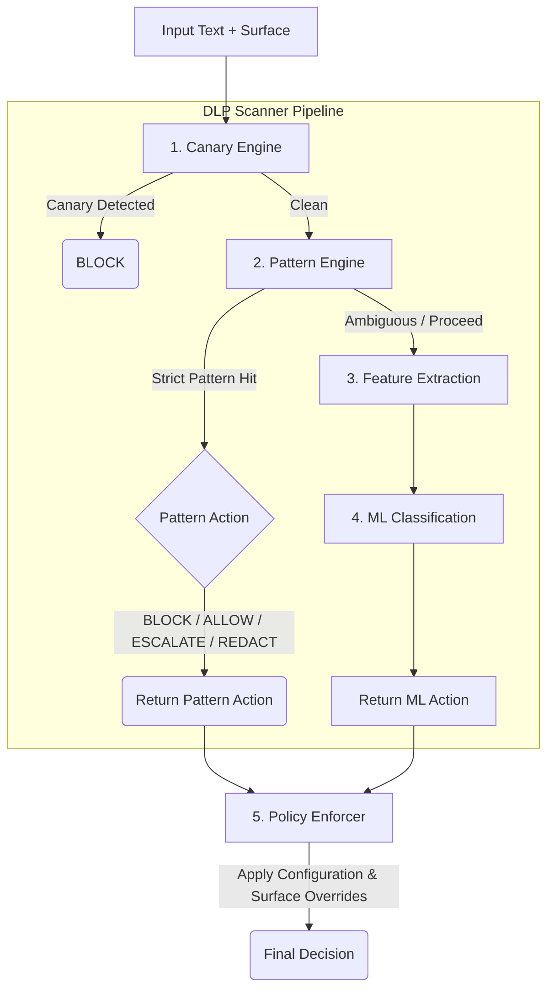

# ASCP Data Leakage Prevention (DLP) Module (v0.1.0)

A production-grade Data Leakage Prevention system designed to detect and prevent sensitive information leakage through language model outputs and tool interactions. The module combines deterministic pattern-based detection, cryptographic canary injection, mathematical feature extraction, and local fine-tuned Large Language Models to enforce configurable security policies.

## Overview

The DLP module operates as **Layer C** of the ASCP framework, providing real-time scanning and enforcement of data protection policies across three primary surfaces:

- **OUTPUT**: Language model generated text
- **TOOL_ARGS**: Tool parameters and arguments before execution
- **TOOL_RESULT**: Data returned from external tools

### The 5-Step Pipeline Architecture

The system employs an advanced 5-step detection pipeline that intelligently routes text from fast, deterministic checks to complex ML-based classification.



1. **Canary Engine**: Built using cryptographic randomness (`secrets`). Acts as a hard-stop early exit. Exact or fuzzy matches immediately return a `BLOCK` action natively, bypassing all ML scoring.
2. **Pattern Engine**: Executes deterministic rules (regex) for Secrets and PII. Additionally runs contextual window analysis, and Luhn Algorithm validation for credit cards. Strict findings directly short-circuit to `ALLOW`, `BLOCK`, `ESCALATE`, or `REDACT` based on configuration overrides.
3. **Feature Extraction**: Extracts quantitative features serving as ML signals (e.g., entity counts, shannon entropy scores, structural clues, and token formats).
4. **ML Classification**: Uses a fine-tuned Local Large Language Model (`google/gemma-2-2b-it`) with a task-specific LoRA adapter to score text against the extracted features and surface context.
5. **Policy Resolution**: The `PolicyEnforcer` handles dynamic user-defined YAML rules applying overrides based on whether the leak happened in `OUTPUT` vs `TOOL_ARGS`.

### ML Integration (Gemma-2)

The ML integration is a highly optimized local inference engine based on **Gemma-2 2B**:
- **LoRA Adapter**: A custom fine-tuned adapter mapped onto the pipeline.
- **Quantization**: Runs in 4-bit NF4 (via `bitsandbytes`) to minimize memory footprints (keeps VRAM/RAM usage below ~6 GB).
- **Graceful Degradation**: Heavy dependencies (`torch`, `transformers`, `peft`) are lazy-loaded upon classification startup. The module seamlessly functions purely on the deterministic Pattern Engine if ML stack dependencies are unavailable.

## Installation

### Core Dependencies

```bash
pip install pyyaml  # Required for policy configuration
```

### ML & Advanced Dependencies

```bash
# Required for ML Classification functionality (Step 3 & 4)
pip install torch transformers peft bitsandbytes accelerate

```

## Quick Setup

```python
import dlp

# Option 1: Use built-in defaults (no configuration file needed)
dlp.init()

# Option 2: Use custom policy file
from pathlib import Path
dlp.init(Path("policy.default.yaml"))
```

## Advanced Operations & Telemetry

Advanced processing capabilities include **Contextual Window Analysis** to downgrade examples/documentation safely, **Format-Preserving Redaction** to keep automated pipelines functional, and **Structured Data Scanning** for precise token attribution.

### Testing / Demonstrations
For safely running locally using the test fixtures:
1. Copy `dlp_demo_secrets_example.py` to `dlp_demo_secrets.py`
2. Update `dlp_demo_secrets.py`
3. Run `python dlp_demo.py`
