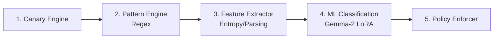

# DLP Module Development

## Philosophy
This branch and module define a complete, 5-Step machine-learning-enhanced scanning architecture optimized for ASCP security operations. Development artifacts should aim to refine deterministic Pattern Rules, Feature Extraction mapping, or ML Prompts before altering the core `PolicyEnforcer`.

## Local Setup & Requirements

Because step 4 of the pipeline relies on local 4-bit NF4 quantized inference of `google/gemma-2-2b-it` alongside LoRA adapters, developers needing to run the complete layer must provide robust ML tooling.

```bash
# Core framework and formatting rules
pip install -r requirements-dev.txt

# ML Specifics for Step 3 & 4 Simulation
pip install torch transformers peft bitsandbytes accelerate
```

### HuggingFace Weights Setup
The base classification model (`gemma-2-2b-it`) requires logging into HuggingFace:
1. Obtain an access token from HuggingFace.
2. Run `huggingface-cli login` on your terminal, or set `export HF_TOKEN="your_token"`.
3. The custom LoRA adapter configurations are provided locally in the `dlp/ML/dlp_lora_package/` directory.

## Modifying the 5-Step Pipeline Architecture



### Tweaking Features (`dlp/features.py`)
Features like Shannon entropy scores, structural clues, and entity counts serve as exact numerical inputs to the ML classification boundary. Editing `features.py` allows you to introduce new signals (e.g., detecting implicit nested JSON structure, specialized framework log patterns) to guide and prompt the Gemma-2 model naturally—avoiding the overhead of retraining the LoRA weights.

### Bypassing the ML Engine for Quick Testing
If you are iterating rapidly on Regex rules, testing `DLPConfig` behavior, or simply do not want to allocate ~1.5GB of ML models into VRAM during local iteration:
Disable the ML step natively by commenting out or hiding ML dependencies (`torch`, `transformers`) in the environment. The `DLPScanner` is resilient and will fully bypass features and ML to execute only steps `1`, `2`, and `5`.

## Testing Conventions

```bash
# Run generic coverage tests (including strict unit checks)
python -m pytest dlp/tests -v

# Run with detailed html/terminal coverage diagnostics
python -m pytest dlp/tests -v --cov=dlp --cov-report=term-missing
```

Integration specs naturally infer your local capabilities. If `torch` / PEFT dependencies are detected, the `pytest` runner will proactively execute end-to-end integration tests routing test payloads through the quantized model outputs automatically to confirm policy alignment.
