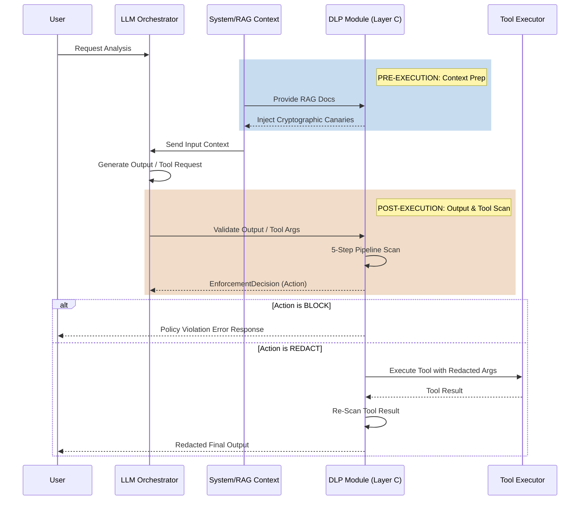

# DLP Module — ASCP Integration Guide

## Overview

The DLP module acts as **Layer C: Data Leakage & Policy Guard** of the ASCP Security Control Plane. It operates at critical functional boundaries to secure your environment.

Integration mainly focuses on two boundaries:
1. **Before the LLM call** — injecting canaries into sensitive internal contexts (system prompt, RAG docs) for tracking.
2. **After the LLM call / Before tool execution** — scanning outputs and tool arguments for sensitive data matches spanning secrets and PII.



## Installation & Initialization

Integration requires the setup of the policy configuration at the application start.

```python
import dlp
from dlp.config import load_dlp_config
from pathlib import Path

# Initialize policies from a YAML definition map or use default
dlp.init(load_dlp_config(Path("policy.default.yaml")))
```

### Lazy Loading & Graceful Degradation
The ML Dependency stack (Gemma-2, PyTorch, Transformers, Peft) is notoriously heavy (~1.5GB VRAM required for inference). 
- **Lazy Loading**: The ML engine is only imported upon the first instantiation of `MLInferenceEngine`. 
- **Fallback**: If `torch` or `transformers` are missing, the DLP pipeline skips Step 3 (Features) and Step 4 (ML) and falls back entirely to Step 2 (the Pattern Engine). Your production application pipeline will never crash strictly because the ML layer could not load.

## Surface Scanning & Behaviors

The system treats different external boundaries as distinct `ScanSurface`s (`OUTPUT`, `TOOL_ARGS`, `TOOL_RESULT`).
This is crucial: Tool Arguments inherently receive stricter policy configurations than loose text Outputs.
You scan by targeting the surface type context:

```python
import dlp
from dlp.models import ScanSurface

# Scan a tool execution attempt (surface is auto-implied as TOOL_ARGS)
decision = dlp.scan_tool_args("database_query", {"query": "SELECT * FROM users"})

if decision.should_block:
    raise ToolCallBlocked(decision.safe_message)

if decision.action.name == "REDACT":
    # Safely proceed with cleaned parameters
    safe_data = decision.clean_text
```

## Policy Configuration Engine (`policy.default.yaml`)
A typical integration adjusts severities proportional to surface bounds:

```yaml
dlp:
  canary_action: BLOCK
  secrets_action: BLOCK
  pii_action: REDACT

  # Dynamic override flag allowing strict downgrade
  downgrade_escalate_to_redact: true
```
If ML categorizes text as `ESCALATE` but the matched finding is only `PII`, the enforcer can use `downgrade_escalate_to_redact` to automatically transform the result to `REDACT`, preventing hard stops for trivial PII strings.
